# Flight delays project

This project looks into the causes of delayed departures at Newark and other New York airports.

It uses logistic modelling in R to identify which factors have a statistically important effect.

## Key documents

**Report**

A document summarising the findings is saved at `report/flight_delays_report`, available in R notebook and HTML formats.

This file also contains the R code used to create the models.

**Data cleaning**

The code used to clean and join the raw data files is saved at `scripts/data_load_clean.R`

## Data cleaning and feature engineering

The cleaning script mentioned above handles missing data, creates derived variables used in my exploratory analysis and in the logistic model, and joins the data.

Examples of the tasks performed are shown below.

Add a column showing if the flight was delayed:

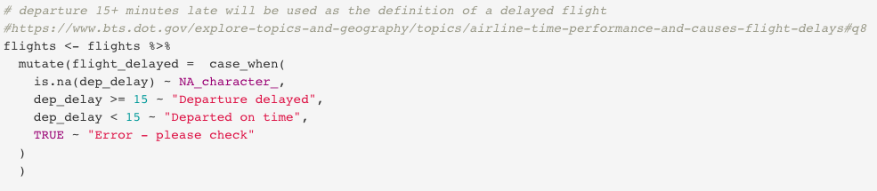

Add buckets for visibility:

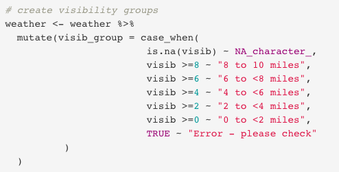

Impute missing wind directions using median for the day:

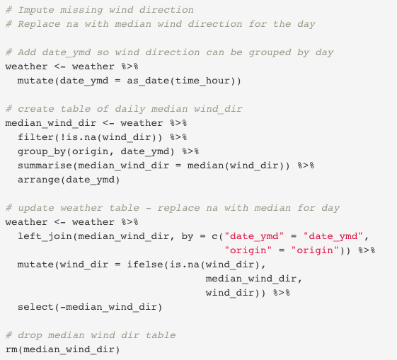

Convert Fahrenheit temperatures to Celsius so they are easier for me to understand in exploratory analysis:

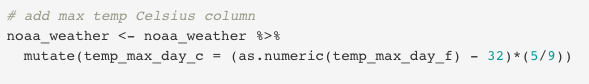

## Screenshots of the report

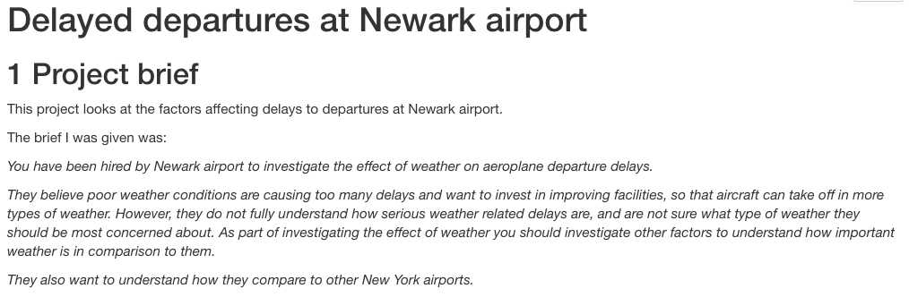

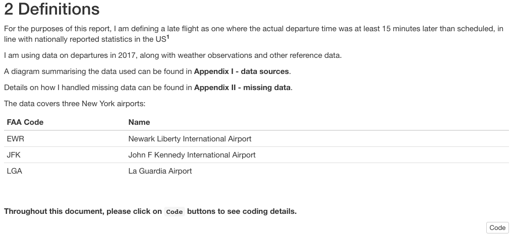

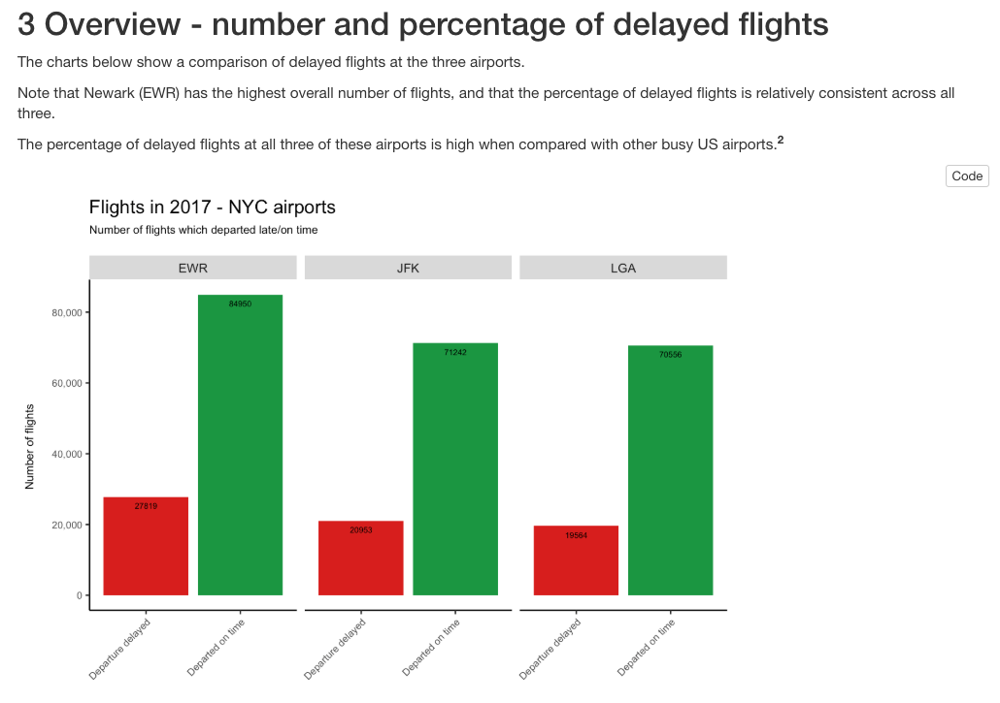

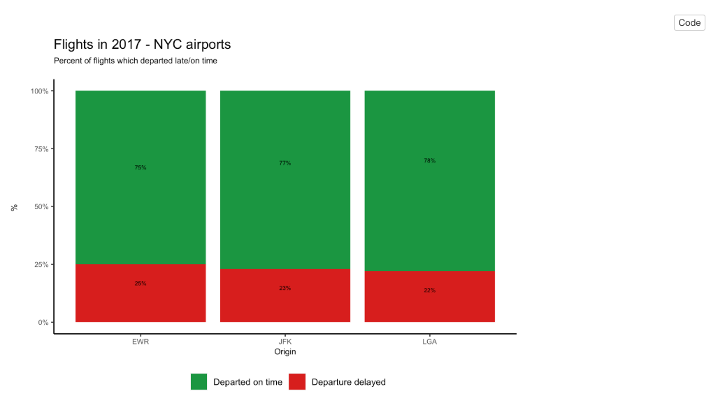

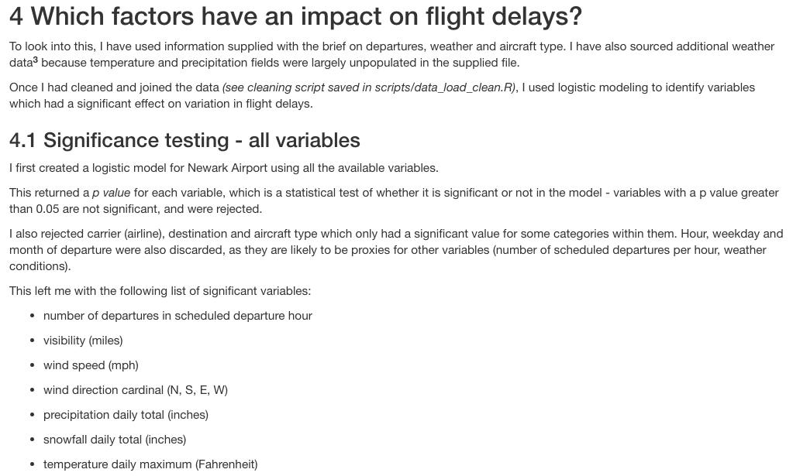

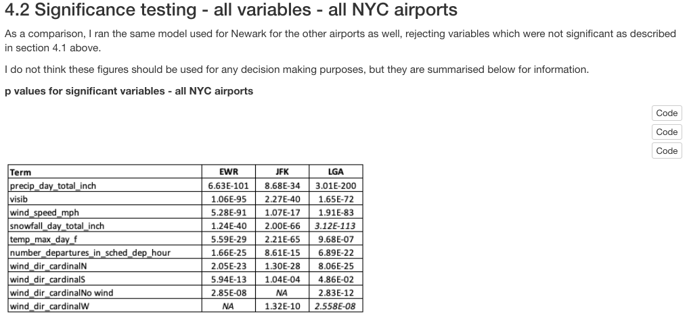

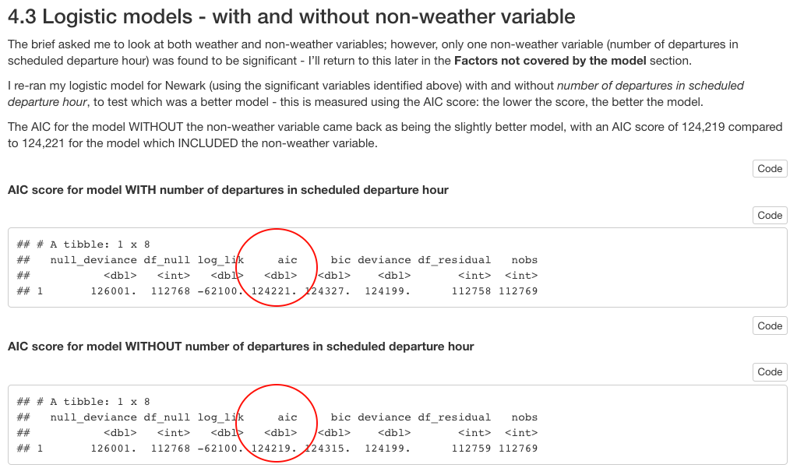

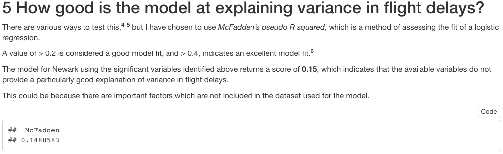

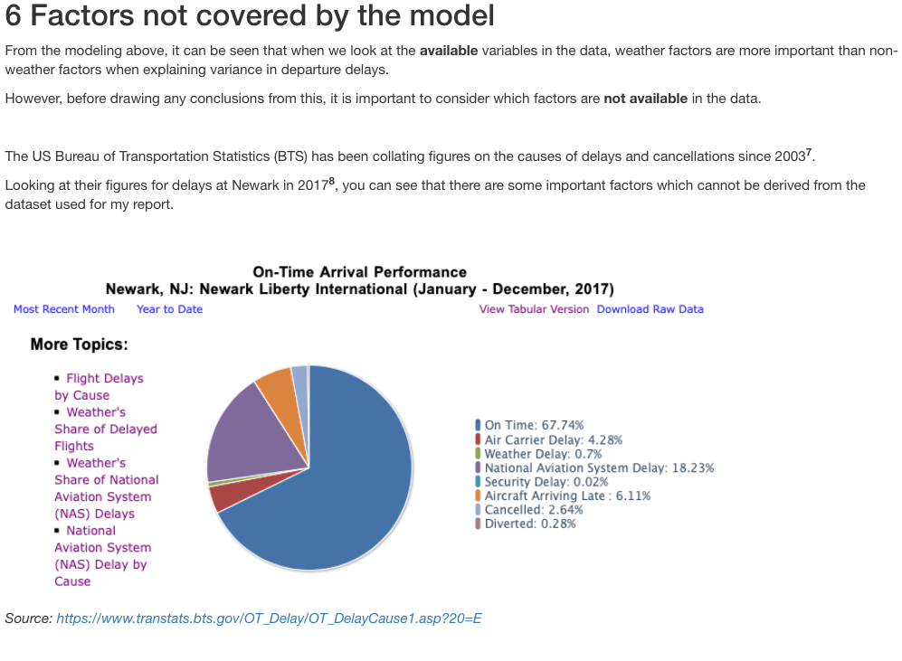

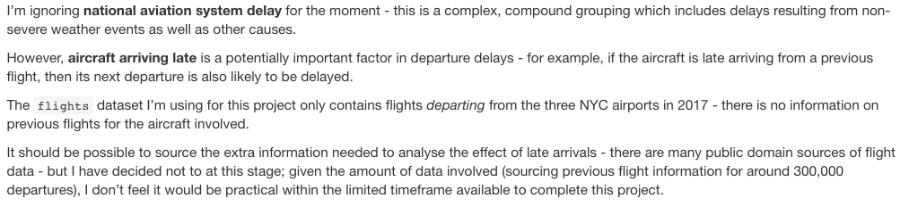

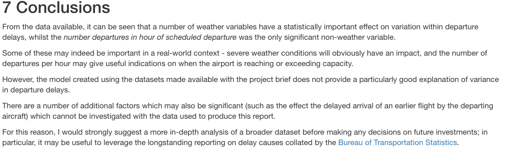

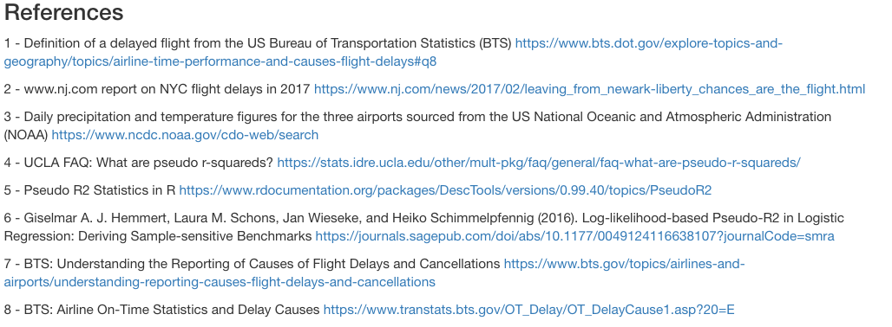

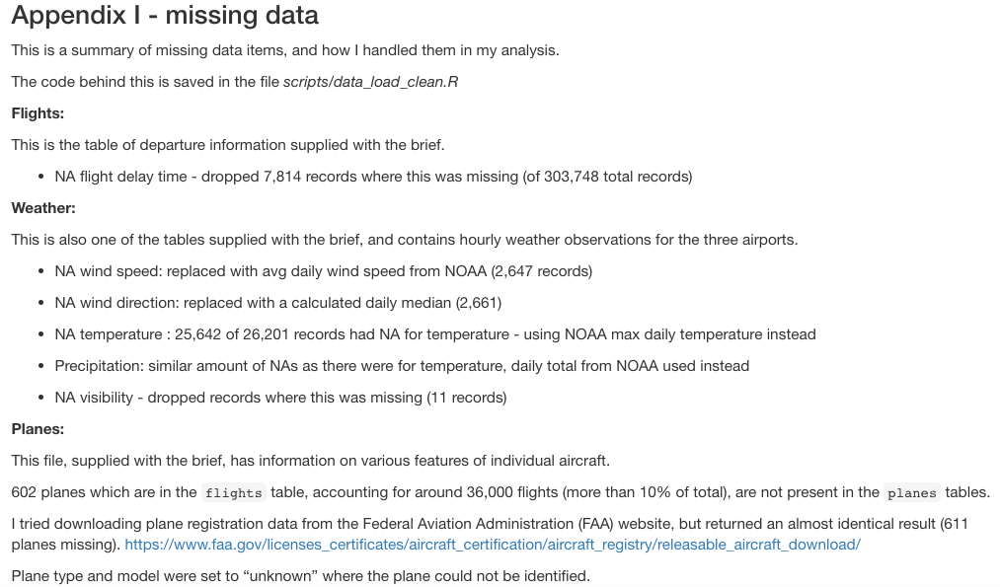

## References mentioned in the report

| Ref 	| Details 	|
|-	|-	|
| 1 	| Definition of a delayed flight from the US Bureau of Transportation Statistics (BTS) https://www.bts.dot.gov/explore-topics-and-geography/topics/airline-time-performance-and-causes-flight-delays#q8 	|
| 2 	| www.nj.com report on NYC flight delays in 2017 https://www.nj.com/news/2017/02/leaving_from_newark-liberty_chances_are_the_flight.html 	|
| 3 	| Daily precipitation and temperature figures for the three airports sourced from the US National Oceanic and Atmospheric Administration (NOAA) https://www.ncdc.noaa.gov/cdo-web/search 	|
| 4 	| UCLA FAQ: What are pseudo r-squareds? https://stats.idre.ucla.edu/other/mult-pkg/faq/general/faq-what-are-pseudo-r-squareds/ 	|
| 5 	| Pseudo R2 Statistics in R https://www.rdocumentation.org/packages/DescTools/versions/0.99.40/topics/PseudoR2 	|
| 6 	| Giselmar A. J. Hemmert, Laura M. Schons, Jan Wieseke, and Heiko Schimmelpfennig (2016). Log-likelihood-based Pseudo-R2 in Logistic Regression: Deriving Sample-sensitive Benchmarks https://journals.sagepub.com/doi/abs/10.1177/0049124116638107?journalCode=smra 	|
| 7 	| BTS: Understanding the Reporting of Causes of Flight Delays and Cancellations https://www.bts.gov/topics/airlines-and-airports/understanding-reporting-causes-flight-delays-and-cancellations 	|
| 8 	| BTS: Airline On-Time Statistics and Delay Causes https://www.transtats.bts.gov/OT_Delay/OT_DelayCause1.asp?20=E 	|

