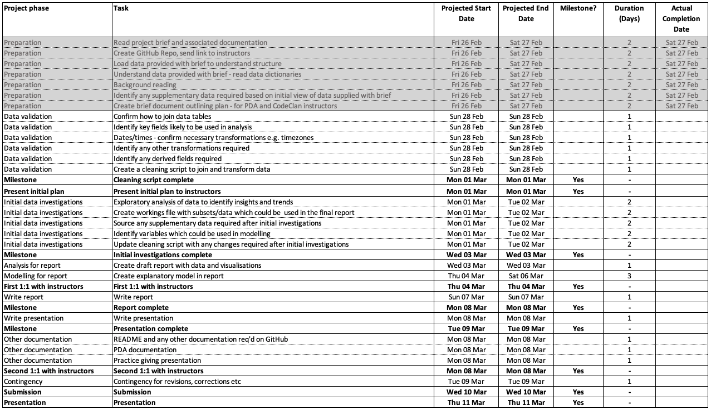
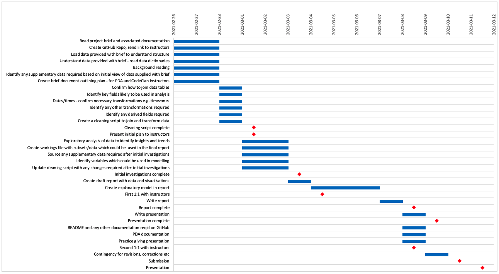
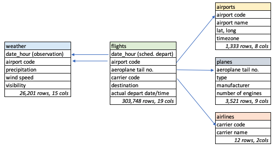

This document covers the pre-project planning for my final assignment on the CodeClan professional data analysis course (Nov 2020  - Mar 2021)

## 1 Project brief

The brief is to look at the impact of weather and other factors on delayed departures at Newark airport:

*"You have been hired by Newark airport to investigate the effect of weather on aeroplane departure delays.*

*They believe poor weather conditions are causing too many delays and want to invest in improving facilities, so that aircraft can take off in more types of weather. However, they do not fully understand how serious weather related delays are, and are not sure what type of weather they should be most concerned about. As part of investigating the effect of weather you should investigate other factors to understand how important weather is in comparison to them*

*They also want to understand how they compare to other New York airports."*

## 2 Project planning

**2.1 Project requirements**

From the brief above, I intend to create a report which:

* Contains analysis/data visualisations which highlight key insights into the data

* Contains an explanatory model which looks at the importance of different types of weather and other variables on the number of delayed flights

* Contains a comparison with other New York airports

* Contains commentary which will allow the client to understand the impact of these various factors, designed to help them make decisions on which improvements to facilities may be worth investing in

**2.2 Systems and tools to be used**

* Analysis will be coded in R, using Rstudio

* Excel will be used for some ancillary documents (project plan, data dictionary, pivot tables for quick exploratory analysis)

* Final versions of reports and other key documents will be available as R markdown/notebook files

* Google Slides or Powerpoint will be used to create a summary of the final report for my presentation

* Sharing of data (with instructors during the course, or with others) will be done via the GitHub repo I've created for the project:

  https://github.com/NeilEcosse/flight_delays_project

**2.3 Data sources**

CodeClan supplied five csv files (and accompanying data dictionary) along with the project brief:

| Table | No. Rows | No. Columns |
|-|-|-|
| flights.csv | 303,748 | 19 |
| weather.csv | 26,201 | 15 |
| planes | 3,521 | 9 |
| airports | 1,333 | 3 |
| airlines | 12 | 1 |

After some initial background reading and research, I have identified some other sources which I may choose to include  depending on the outcome of my initial analysis:

* Daylight hours, possibly using the `geosphere` package

* Possibly some extra detail on weather (e.g. at destination airports, not covered in the supplied file `weather.csv`); I may use a package such as `weatherData` https://www.rdocumentation.org/packages/weatherData/versions/0.5.0

* There are other sources of flight data which show reasons for flight delays - I'm not sure how/if I'm going to use these, because I want to make sure the analysis for the project is my own work. However, there are classifications of types of delayed flights which could be useful (Air Carrier, Extreme Weather, National Aviation System (which includes non-extreme weather), Late-arriving aircraft and Security)

  https://www.bts.gov/topics/airlines-and-airports/understanding-reporting-causes-flight-delays-and-cancellations
  
  
  

**2.4 Definition of a delayed flight**

This is not explicitly defined in the brief - if this were a genuine professional project rather than an educational exercise, I would consult with the client on this.

I have chosen to define a flight as late where the **actual departure time is at least 15 minutes later than the scheduled departure time.**

This is in line with the US Bureau of Transportation Statistics definition:

*"A flight is counted as 'on time' if it operated less than 15 minutes later than the scheduled time shown in the carriers' Computerized Reservations Systems (CRS). Arrival performance is based on arrival at the gate. Departure performance is based on departure from the gate."*

https://www.bts.dot.gov/explore-topics-and-geography/topics/airline-time-performance-and-causes-flight-delays#q8

**2.5 Which aspects of the data will I be looking at?**

Having read the brief, I loaded the data and had a look through it, referring to the data dictionary to make sure I understood what each field contained.

I will look into this in more detail when I start my exploratory analysis, but these are the points I will start looking at:

* The brief says that the client is concerned about the impact of weather on delayed departures, so I will be linking departure data in the `flights` table to the `weather` table (by date, time and location) to look for trends or insights 

* The brief also asks me to look at other factors beyond weather conditions, so I will be looking for variables which can help me with this (e.g. aircraft type, time of day, possibly day of week etc). This is probably the area I'm least sure about before starting my exploratory analysis, because I'm not sure how how much I can find or derive from the core datasets (e.g. finding out if the cause of delay was late arrival of a previous flight by the same aircraft).

* The client is looking for insights into the relative importance of weather and other factors - this suggests that an explanatory model would be useful to find out which variables can be used to explain variance in the number of delayed flights; my analysis will aim to find (or derive) these variables.

**2.6 Tracking project progress**

I have created a Gantt chart in Excel to capture my initial thoughts on the necessary project phases and tasks, along with deadlines/checkpoints such as the submission date and 1:1 meetings with CodeClan instructors.

This shows indicative dates for the various tasks, and will be used to track my progress:

## 3 Data quality issues

As a minimum, I will be checking my data for:

* Missing values

* Duplicated records

* Invalid values (e.g. non-existent latitude/longitude locations)

I will also need to be careful to ensure the integrity of date/time fields, especially as I may be trying to link records for locations in different time zones.

I will get a better picture of what issues there are, and how to deal with missing data (delete, impute etc)  during my exploratory analysis.

## 4 Feature engineering

As well as looking at data quality, I will need to create derived fields.

This will become clearer once I begin my initial exploratory analysis, but  new fields I create could include:

* TRUE/FALSE `delayed_departure` based on the difference between `scheduled departure time` and `actual departure time`

* Using the `wind direction` (currently in degrees) to create a new column showing compass direction (N, NE etc)

* Possibly creating columns where imperial measurements have been converted to metric ones (e.g. temperature - although this project is for an American client, I will find it easier to do my analysis in Celsius than Fahrenheit)

* Converting fields so they are categorical, so I can use them in models

## 5 Data bias

As the flight data represents a full record of flight information three New York airports in 2017, I don't think there is too much scope for bias - it is not a sample, and it is not a survey. 

## 6 Data structure

The most important tables, containing most of the data, are `flights` and `weather`

These two tables can be linked using airport code, date and time; this will be important in my analysis - e.g. to find out weather conditions in the hour of a scheduled departure.

The other tables may provide variables useful in my analysis (e.g. plane type or manufacturer), or give text descriptions of codes I can add to make my report easier to understand (e.g. looking up airport name from airport code).

The diagram below shows the relationship between the five core datasets to be used in the project - arrows show the key fields used for joins .

Note that the column names listed are not exhaustive - e.g. the `flights` table has 19 columns.

## 7 Domain expert collaboration

Although I will be producing this project alone, I will seek input and guidance from CodeClan instructors where I think this will be beneficial; I may also try finding someone who knows more about the aviation industry than me for advice.
