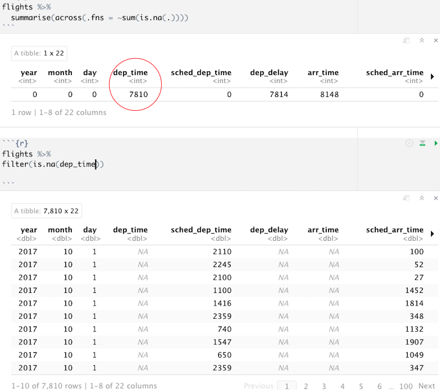
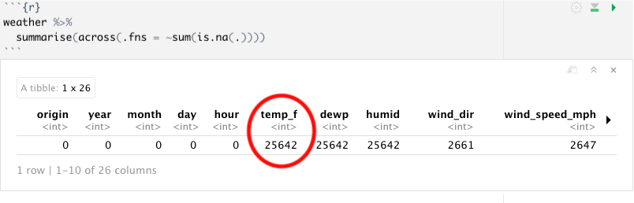
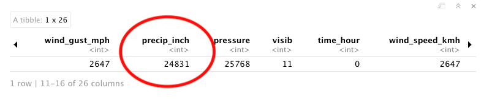

## 1 Handling of missing values

The `flight` data had around 8,000 records (out of a total of 304k records) where the actual departure time or departure delay was NA - I decided to drop these from my analysis:

NAs in the `weather` table were more of an issue: all but around 600 had NA for temperature, and all but around 1,400 had NA for precipitation:

