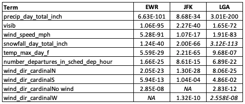
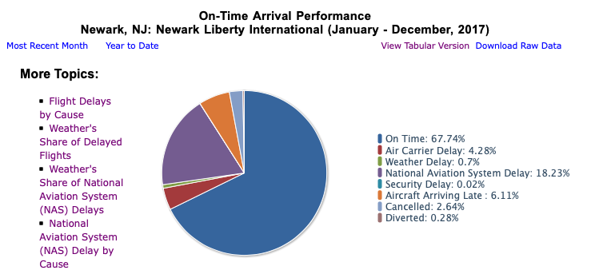

---
output:
  html_document:
    code_folding: hide
  html_notebook: default
  pdf_document: default
---

# Delayed departures at Newark airport

## 1 Project brief

This project looks at the factors affecting delays to departures at Newark airport.

The brief I was given was:

*You have been hired by Newark airport to investigate the effect of weather on aeroplane departure delays.*

*They believe poor weather conditions are causing too many delays and want to invest in improving facilities, so that aircraft can take off in more types of weather. However, they do not fully understand how serious weather related delays are, and are not sure what type of weather they should be most concerned about. As part of investigating the effect of weather you should investigate other factors to understand how important weather is in comparison to them*

*They also want to understand how they compare to other New York airports.*

## 2 Definitions

For the purposes of this report, I am defining a late flight as one where the actual departure time was at least 15 minutes later than scheduled, in line with nationally reported statistics in the US^1^ 

I am using data on departures in 2017 from the following airports:

| FAA Code 	| Name 	|
|-	|-	|
| EWR 	| Newark Liberty International Airport 	|
| JFK 	| John F Kennedy International Airport 	|
| LGA 	| La Guardia Airport 	|

```{r, warning = F, message = F}

library(tidyverse)
library(here)
library(modelr)
library(GGally)
library(broom)
library(janitor)
library(anyflights)


all_data_clean <-
read_csv(here("data_clean/all_data_clean.csv")) %>% 

mutate(sched_dep_month = as.factor(sched_dep_month)) %>%
mutate(sched_dep_weekday = as.factor(sched_dep_weekday)) %>%
mutate(sched_dep_hour = as.factor(sched_dep_hour)) %>%
mutate(sched_dep_hour_group = as.factor(sched_dep_hour_group)) %>%
mutate(dest = as.factor(dest)) %>% 
mutate(carrier = as.factor(carrier)) %>% 
mutate(tailnum = as.factor(tailnum)) %>% 
mutate(plane_type = as.factor(plane_type)) %>% 
mutate(plane_model = as.factor(plane_model)) %>% 
mutate(engine = as.factor(engine)) %>% 
mutate(engines = as.factor(engines)) %>% 
mutate(visib_group = as.factor(visib_group)) %>%
mutate(wind_speed_beaufort_name = as.factor(wind_speed_beaufort_name)) %>%
mutate(wind_gust_beaufort_name = as.factor(wind_gust_beaufort_name)) %>%
mutate(wind_dir_cardinal = as.factor(wind_dir_cardinal)) %>%
mutate(precip_day_total_inch_group = as.factor(precip_day_total_inch_group)) %>%
mutate(snow_depth_day_total_inch_group = as.factor(snow_depth_day_total_inch_group)) 

```

## 3 Overview - number and percentage of delayed flights

The charts below show a comparison of delayed flights at the three airports.

Note that Newark (EWR) has the highest overall number of flights, and that the percentage of delayed flights is relatively consistent across all three.

The percentage of delayed flights at all three of these airports is high when compared with other busy US airports.^2^


```{r, warning = F, message = F}

all_data_clean %>% 
  
    mutate(flight_delayed = 
           fct_relevel(flight_delayed, 
                       "Departure delayed",
                       "Departed on time")) %>% 
  
  group_by(origin, flight_delayed) %>% 
  summarise(count = n()) %>% 
  
  ggplot()+
  aes(x = flight_delayed, y = count, fill = flight_delayed) +
  
  geom_col() +
  
  geom_text(aes(x = flight_delayed,
                y = count,
                label = count,
                vjust = 2),check_overlap = TRUE, size = 2) +

  
  facet_grid(~origin) +
  
  scale_y_continuous(labels = scales::comma) +
  
    scale_fill_manual(
    values = c(
      "Departure delayed" = "#d7191c",
      "Departed on time" = "#1a9641"
    )
  ) +
  
  theme(legend.position = "") +
  theme(plot.subtitle = element_text(size = 8)) +
  theme(axis.text = element_text(size = 7)) +
  theme(axis.text.x = element_text(angle = 45, hjust=1)) +
  theme(axis.title = element_text(size = 8)) +
  
  theme(panel.grid.major = element_blank(), panel.grid.minor = element_blank(),
panel.background = element_blank(), axis.line = element_line(colour = "black")) +
  
  labs(title = "Flights in 2017 - NYC airports",
       subtitle = "Number of flights which departed late/on time  \n",
       x = "",
       y = "Number of flights \n")
```


```{r, warning = F, message = F}
# Total flights by airport
total_flights_by_airport <- all_data_clean %>% 
  group_by(origin) %>% 
  summarise(total_flights = n())
  

  all_data_clean %>%
  group_by(origin, flight_delayed) %>% 
  summarise(count_delayed_on_time = n()) %>% 
  left_join(total_flights_by_airport, by = "origin") %>% 
  mutate(pct_delayed_on_time = round((count_delayed_on_time/total_flights),2)) %>%

  
  ggplot()+
  geom_col() +
  aes(x = origin, y = pct_delayed_on_time, fill = flight_delayed) +
    
   geom_text(aes(label = str_c((100*pct_delayed_on_time), "%", sep = ""),
                position = "stack",
                vjust = 5),size = 2) +

  
  scale_y_continuous(labels = scales::percent) +
    
  scale_fill_manual(
    values = c(
      "Departure delayed" = "#d7191c",
      "Departed on time" = "#1a9641"
    )
  ) +
  
  theme(legend.position = "bottom") +
  theme(plot.subtitle = element_text(size = 8)) +
  theme(axis.text = element_text(size = 7)) +
  theme(axis.title = element_text(size = 8)) +
  
  theme(panel.grid.major = element_blank(), panel.grid.minor = element_blank(),
panel.background = element_blank(), axis.line = element_line(colour = "black")) +
  
  labs(title = "Flights in 2017 - NYC airports",
       subtitle = "Percent of flights which departed late/on time  \n",
       x = "Origin",
       y = "% \n",
       fill = "")
```

## 4 Which factors have an impact on flight delays?

To look into this, I have used information supplied with the brief on departures, weather and aircraft type. I have also sourced additional weather data^3^ because temperature and precipitation fields were largely unpopulated in the supplied file.

Details on how I handled missing or incomplete data can be found in **Appendix I - missing data**

Once I had cleaned and joined the data *(see cleaning script saved in scripts/data_load_clean.R)*, I used logistic modeling to identify variables which had a significant affect on variation in flight delays.


### 4.1 Significance testing - all variables


I first created a model for Newark Airport using all the available variables.

This returned a *p value* for each variable, which is a statistical test of whether it is significant or not in the model - variables with a p value greater than 0.05 are not significant, and were rejected.

I also rejected carrier (airline), destination and aircraft type which only had a significant value for some categories within them. Hour, weekday and month of departure were also discarded, as they are likely to be proxies for other variables (number of scheduled departures per hour, weather conditions).

This left me with the following list of significant variables:

* number of departures in scheduled departure hour

* visibility (miles)

* wind speed (mph)

* wind direction cardinal (N, S, E, W)

* precipitation daily total (inches)

* snowfall daily total (inches)

* temperature daily maximum (Fahrenheit)

```{r}
# Data for model
model_dataset_ewr <- all_data_clean %>%
  filter(origin == "EWR") %>%   
  mutate(flight_delayed_numeric = as.factor(ifelse(flight_delayed == "Departure delayed", 1, 0))) %>% 
select(   # from FLIGHTS
         flight_delayed_numeric,
         sched_dep_month,
         sched_dep_weekday,
         sched_dep_hour,
         number_departures_in_sched_dep_hour,
         dest,
         carrier,
         plane_type,
         # from WEATHER, NOAA_WEATHER
         visib,
         wind_speed_mph,
         wind_dir_cardinal,
         precip_day_total_inch,
         snowfall_day_total_inch,
         temp_max_day_f,
         temp_min_day_f,
         # from AIRPORTS
         dest_lat,
         dest_long) 
```

```{r}
# Logistic model EWR
ewr_multi_logreg_model <- glm(flight_delayed_numeric ~ ., 
         data = model_dataset_ewr, family = binomial(link = 'logit'))

ewr_tidy_out <- clean_names(tidy(ewr_multi_logreg_model))
glance_out <- clean_names(glance(ewr_multi_logreg_model))

clean_names(tidy(ewr_multi_logreg_model)) %>% 
  select(term, p_value) %>% 
  filter(p_value < 0.05) %>% 
  arrange(desc(term))
```

### 4.2 Significance testing - all variables - all NYC airports

As a comparison, I ran the same model used for Newark for the other airports as well, rejecting variables which were not significant as described in section 4.1 above. 

I do not think these figures should be used for any decision making purposes, but they are summarised below for information.

**p values for significant variables - all NYC airports**




```{r}
# Data for model - JFK
model_dataset_jfk <- all_data_clean %>%
  filter(origin == "JFK") %>%   
  mutate(flight_delayed_numeric = as.factor(ifelse(flight_delayed == "Departure delayed", 1, 0))) %>% 
select(   # from FLIGHTS
         flight_delayed_numeric,
         sched_dep_month,
         sched_dep_weekday,
         sched_dep_hour,
         number_departures_in_sched_dep_hour,
         dest,
         carrier,
         plane_type,
         # from WEATHER, NOAA_WEATHER
         visib,
         wind_speed_mph,
         wind_dir_cardinal,
         precip_day_total_inch,
         snowfall_day_total_inch,
         temp_max_day_f,
         temp_min_day_f,
         # from AIRPORTS
         dest_lat,
         dest_long) 

#Logistic model - JFK
jfk_multi_logreg_model <- glm(flight_delayed_numeric ~ ., 
         data = model_dataset_jfk, family = binomial(link = 'logit'))

jfk_tidy_out <- clean_names(tidy(jfk_multi_logreg_model))
jfk_glance_out <- clean_names(glance(jfk_multi_logreg_model))

jfk_significant_p_values <-  clean_names(tidy(jfk_multi_logreg_model)) %>%
  mutate(origin  = "JFK") %>% 
  select(origin, term, p_value) %>% 
  filter(p_value < 0.05) %>% 
  arrange(desc(term))

```

```{r}
# Data for model - LGA
model_dataset_lga <- all_data_clean %>%
  filter(origin == "LGA") %>%   
  mutate(flight_delayed_numeric = as.factor(ifelse(flight_delayed == "Departure delayed", 1, 0))) %>% 
select(   # from FLIGHTS
         flight_delayed_numeric,
         sched_dep_month,
         sched_dep_weekday,
         sched_dep_hour,
         number_departures_in_sched_dep_hour,
         dest,
         carrier,
         plane_type,
         # from WEATHER, NOAA_WEATHER
         visib,
         wind_speed_mph,
         wind_dir_cardinal,
         precip_day_total_inch,
         snowfall_day_total_inch,
         temp_max_day_f,
         temp_min_day_f,
         # from AIRPORTS
         dest_lat,
         dest_long) 

#Logistic model - LGA
lga_multi_logreg_model <- glm(flight_delayed_numeric ~ ., 
         data = model_dataset_lga, family = binomial(link = 'logit'))

lga_tidy_out <- clean_names(tidy(lga_multi_logreg_model))
lga_glance_out <- clean_names(glance(lga_multi_logreg_model))

lga_significant_p_values <-  clean_names(tidy(lga_multi_logreg_model)) %>%
  mutate(origin  = "LGA") %>% 
  select(origin, term, p_value) %>%  
  filter(p_value < 0.05) %>% 
  arrange(desc(term))
```

```{r}
# Combine significant p_values for all three airports into one table

ewr_significant_p_values <-  clean_names(tidy(ewr_multi_logreg_model)) %>%
  mutate(origin  = "EWR") %>%
  select(origin, term, p_value) %>% 
  filter(p_value < 0.05) %>% 
  arrange(desc(term)) 

all_airports_significant_p_values <- 
  bind_rows(ewr_significant_p_values,
            jfk_significant_p_values,
            lga_significant_p_values) %>% 
  pivot_wider(names_from = "origin", values_from = "p_value")


```


### 4.3 Logistic models - with and without non-weather variable

The brief asked me to look at both weather and non-weather variables; however, only one non-weather variable (number of departures in scheduled departure hour) was found to be significant - I'll return to this later in the **Factors not covered by the model** section.

I re-ran my logistic model for Newark (using the significant variables identified above) with and without *number of departures in scheduled departure hour*, to test which was a better model - this is measured using the AIC score: the lower the score, the better the model.

The AIC for the model WITHOUT the non-weather variable came back as being the slightly better model, with an AIC score of 124,219 compared to 124,221 for the model which INCLUDED the non-weather variable.


```{r}
# Data for model - significant variables only
model_dataset_significant_ewr <- all_data_clean %>%
  filter(origin == "EWR") %>%   
  mutate(flight_delayed_numeric = as.factor(ifelse(flight_delayed == "Departure delayed", 1, 0))) %>% 
select(   # from FLIGHTS
         flight_delayed_numeric,
         number_departures_in_sched_dep_hour,
         # from WEATHER, NOAA_WEATHER
         visib,
         wind_speed_mph,
         wind_dir_cardinal,
         precip_day_total_inch,
         snowfall_day_total_inch,
         temp_max_day_f) 
```


**AIC score for model WITH number of departures in scheduled departure hour**
```{r}
# Model WITH number of departures in scheduled departure hour
ewr_weather_and_nonweather_logreg_model <- glm(flight_delayed_numeric ~ ., 
         data = model_dataset_significant_ewr, family = binomial(link = 'logit'))

ewr_tidy_weather_non_weather_out <- clean_names(tidy(ewr_weather_and_nonweather_logreg_model))
glance_weather_non_weather_out <- clean_names(glance(ewr_weather_and_nonweather_logreg_model))

glance_weather_non_weather_out

```
```{r}
# Data for model - significant variables only WITHOUT no. departs in sched dep hour
model_dataset_significant_weather_ewr <- model_dataset_significant_ewr %>% 
select(-number_departures_in_sched_dep_hour) 
```

**AIC score for model WITHOUT number of departures in scheduled departure hour**
```{r}
# Model WITHOUT number of departures in scheduled departure hour
ewr_weather_logreg_model <- glm(flight_delayed_numeric ~ ., 
         data = model_dataset_significant_weather_ewr, family = binomial(link = 'logit'))

ewr_tidy_weather_out <- clean_names(tidy(ewr_weather_logreg_model))
glance_weather_out <- clean_names(glance(ewr_weather_logreg_model))

glance_weather_out
```

## 5 Factors not covered by the model

From the modeling above, it can be seen that when we look at the **available** variables in the data, weather factors are more important than non-weather factors when explaining variance in departure delays.

However, before drawing any conclusions from this, it is important to consider which factors are **not available** in the data.


The US Bureau of Transportation Statistics (BTS) has been collating figures on the causes of delays and cancellations since 2003^4^. 

Looking at their figures for late **arrivals and departures** at Newark in 2017^5^, you can see that there are some important factors which cannot be derived from the dataset used for my report.




*Source: https://www.transtats.bts.gov/OT_Delay/OT_DelayCause1.asp?20=E*


I'm ignoring **national aviation system delay** for the moment - this is a complex, compound grouping which includes delays resulting from non-severe weather events as well as other causes.

However, **aircraft arriving late** is a potentially important factor in departure delays - for example, if the aircraft is late arriving from a previous flight, then its next departure is also likely to be delayed.

The `flights` dataset I'm using for this project only contains flights departing from the three NYC airports in 2017 - there is no information on previous flights for the aircraft involved.

It should be possible to source the extra information needed to analyse the effect of late arrivals - there are many public domain sources of flight data - but I have decided not to at this stage; given the amount of data involved (sourcing previous flight information for around 300,000 departures),  I don't feel it would be practical within the limited timeframe available to complete this project.

##  6 Conclusions

From the data available, it can be seen that a number of weather variables have a statistically important effect on variation within departure delays, whilst the *number departures in hour of scheduled departure* was the only significant non-weather variable.

Some of these may indeed be important in a real-world context - severe weather conditions will obviously have an impact, and the number of departures per hour may give useful indications on when the airport is reaching or exceeding capacity.


However, there are a number of factors which may be even more significant (such as the effect the delayed arrival of an earlier flight by the departing aircraft) which cannot be investigated with the data used to produce this report.

For this reason, I would strongly suggest a more in-depth analysis of a broader dataset before making any decisions on future investments; in particular, it may be useful to leverage the longstanding reporting on delay causes collated by the [Bureau of Transportation Statistics](https://www.transtats.bts.gov/OT_Delay/OT_DelayCause1.asp).


### References

1 -   Definition of a delayed flight from the US Bureau of Transportation Statistics (BTS) https://www.bts.dot.gov/explore-topics-and-geography/topics/airline-time-performance-and-causes-flight-delays#q8

2 -   www.nj.com report on NYC flight delays in 2017 https://www.nj.com/news/2017/02/leaving_from_newark-liberty_chances_are_the_flight.html

3 -   Daily precipitation and temperature figures for the three airports sourced from the US National Oceanic and Atmospheric Administration (NOAA) https://www.ncdc.noaa.gov/cdo-web/search

4 -   BTS: Understanding the Reporting of Causes of Flight Delays and Cancellations https://www.bts.gov/topics/airlines-and-airports/understanding-reporting-causes-flight-delays-and-cancellations

5 -   BTS: Airline On-Time Statistics and Delay Causes https://www.transtats.bts.gov/OT_Delay/OT_DelayCause1.asp?20=E


### Appendix I -  missing data

This is a summary of missing of incomplete data items, and how I handled them in my analysis.

The code behind this is saved in the file *scripts/data_load_clean.R*

**Flights:**

This is the table of departure information supplied with the brief.

* NA flight delay time - dropped 7,814 records where this was missing (of 303,748 total records)

**Weather:**

This is also one of the tables supplied with the brief, and contains hourly weather observations for the three airports.

* NA wind speed: replaced with avg daily wind speed from NOAA (2,647 records)

* NA wind direction: replaced with a calculated daily median (2,661)

* NA temperature : 25,642 of 26,201 records had NA for temperature - using NOAA max daily temperature instead

* Precipitation: similar amount of NAs as there were for temperature, daily total from NOAA used instead

* NA visibility - dropped records where this was missing (11 records)

**Planes:**

This file, supplied with the brief, has information on various features of individual aircraft.

602 planes which are in the `flights` table, accounting for around 36,000 flights (more than 10% of total), are not present in the `planes` tables.

I tried downloading plane registration data from the Federal Aviation Administration (FAA) website, but returned an almost identical result (611 planes missing).
https://www.faa.gov/licenses_certificates/aircraft_certification/aircraft_registry/releasable_aircraft_download/

Plane type and model were set to "unknown" where the plane could not be identified.
